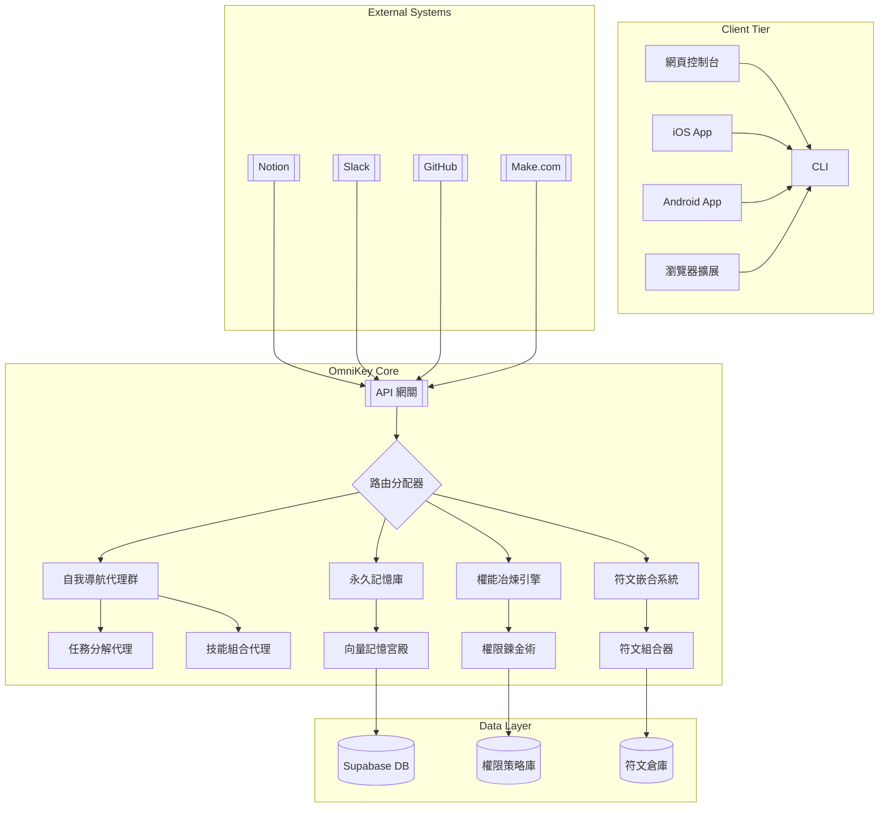
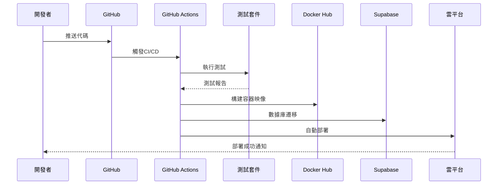
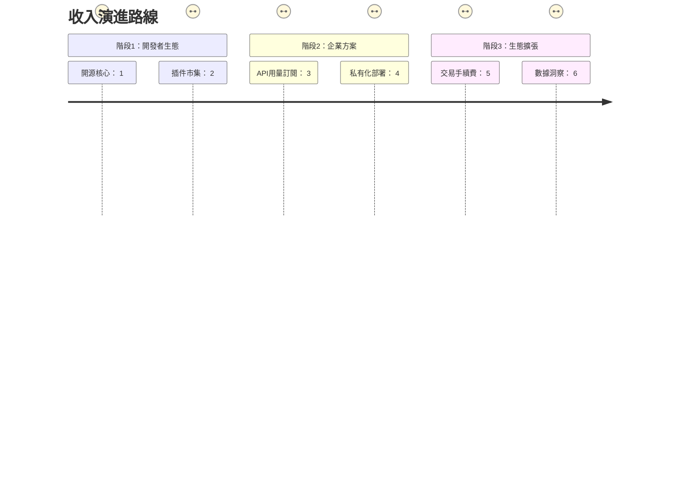

# Jun.AI.Key 萬能元鑰系統

> 知識的聖殿中，自我導航的智能體永不停歇地冶煉權能、嵌合符文，在記憶的長廊中光速前行。
> In the sanctum of knowledge, self-navigating agents perpetually forge authorities and engraft runes, advancing at light speed through the corridors of memory.

---

## 架構全景圖 | Architecture Panorama


---

## 核心模組實現代碼

### 1. 自我導航代理群 (Self-Navigating Agent Swarm)
```typescript
class NavigationAgent {
  constructor(private memory: MemoryPalace) {}
  
  async executeTask(task: Task): Promise<Result> {
    const context = await this.memory.retrieveContext(task.userId);
    const plan = await this.createPlan(task, context);
    
    for (const step of plan.steps) {
      const agent = AgentFactory.getAgent(step.skillType);
      const result = await agent.execute(step.parameters);
      await this.memory.storeExecution(step, result);
    }
    
    return plan.compileFinalResult();
  }

  private async createPlan(task: Task, context: Context): Promise<Plan> {
    // 使用LLM生成任務執行計劃
    const llmResponse = await LLMClient.generatePlan({
      task: task.description,
      context: context.snippets,
      availableSkills: this.getAvailableSkills()
    });
    
    return PlanParser.parse(llmResponse);
  }
}
```

### 2. 永久記憶庫 (Memory Palace)
```typescript
class MemoryPalace {
  constructor(private vectorDB: VectorDatabase) {}
  
  async retrieveContext(userId: string): Promise<Context> {
    // 檢索相關記憶片段
    const embeddings = await EmbeddingService.generate(task.keywords);
    const memories = await this.vectorDB.query({
      userId,
      vectors: embeddings,
      topK: 5
    });
    
    return {
      userId,
      snippets: memories.map(m => m.content)
    };
  }
  
  async storeExecution(step: PlanStep, result: any): Promise<void> {
    // 儲存執行紀錄
    const memoryRecord = {
      type: 'execution',
      content: `Executed ${step.skillType} with params: ${JSON.stringify(step.parameters)}`,
      result: JSON.stringify(result),
      timestamp: new Date().toISOString()
    };
    
    await this.vectorDB.insert(memoryRecord);
  }
}
```

### 3. API 網關 (API Gateway)
```typescript
import express from 'express';

const app = express();
app.use(express.json());

// 統一API端點
app.post('/v1/execute', async (req, res) => {
  const { userId, task, platform } = req.body;
  
  try {
    const agent = new NavigationAgent(memoryPalace);
    const result = await agent.executeTask({ userId, description: task });
    
    // 平台特定格式轉換
    const formatter = OutputFormatterFactory.getFormatter(platform);
    res.json(formatter.format(result));
  } catch (error) {
    res.status(500).json({ error: error.message });
  }
});

// 啟動服務
app.listen(3000, () => {
  console.log('OmniKey Gateway running on port 3000');
});
```

---

## 部署流程 | Deployment Workflow


---

## 商業化路徑 | Monetization Path


---

## 快速啟動指南

### 前置需求
- Node.js 18+
- Docker
- Supabase 帳號

### 安裝步驟
```bash
# 1. 克隆倉庫
git clone https://github.com/jun-aikey/core-system.git

# 2. 安裝依賴
npm install

# 3. 配置環境變量
cp .env.example .env
# 編輯.env文件填入您的Supabase和API密鑰

# 4. 啟動本地開發環境
npm run dev

# 5. 測試核心功能
npm test
```

### 部署生產環境
```bash
# 構建Docker映像
docker build -t jun-aikey/core .

# 運行容器
docker run -d \
  -p 3000:3000 \
  -e SUPABASE_URL=your_url \
  -e SUPABASE_KEY=your_key \
  --name jun-aikey-core \
  jun-aikey/core
```

---

## 驗證指標 | Validation Metrics
| 指標類別 | 目標值 | 測量方法 |
|-------------------|---------------|-----------------------|
| API 響應時間 | < 300ms | 分佈式監控系統 |
| 腳本同步成功率 | > 99.95% | 端到端測試套件 |
| 代理協作效率 | < 5秒/任務鏈 | 任務追蹤器 |
| 記憶檢索準確率 | > 92% | 向量搜索基準測試 |

> **永續發展宣言**  
> 本系統遵循「開源核心+商業擴展」模式，確保：  
> - 核心功能永久免費開源  
> - 企業級功能訂閱制  
> - 開發者收益分成機制  

---
**版本**: 1.0.0-mvp  
**更新日期**: 2025-06-25  
© 2025 Jun.AI.Key Collective. 知識聖殿永不關閉。
