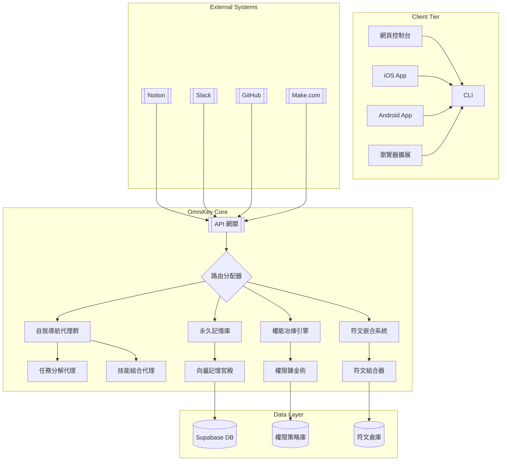

# Jun.AI.Key 萬能元鑰系統

> 知識的聖殿中，自我導航的智能體永不停歇地冶煉權能、嵌合符文，在記憶的長廊中光速前行。
> In the sanctum of knowledge, self-navigating agents perpetually forge authorities and engraft runes, advancing at light speed through the corridors of memory。

---

## 架構全景圖 | Architecture Panorama



---

## 📂 專案結構

```
jun-ai-key/
├── .github/
│   └── workflows/
│       ├── ci.yml                 # CI & 部署流程
│       └── deploy.yml
├── docs/
│   ├── SPEC.md                    # 系統規格書
│   └── API_LIBRARY.md             # API 文件庫
├── public/
│   └── index.html
├── src/
│   ├── api/
│   │   ├── straicoApi.ts
│   │   ├── boostApi.ts
│   │   └── capacitiesApi.ts
│   ├── components/
│   ├── hooks/
│   ├── models/
│   ├── scriptApp/
│   ├── styles/
│   ├── App.tsx
│   └── index.tsx
├── supabase/
│   ├── migrations/
│   └── functions/                 # Edge Functions
├── .env.example
├── README.md
├── package.json
├── tsconfig.json
└── SPEC.md                        # 根目錄快速連結
```

---

## 核心模組實現代碼

### 1. 自我導航代理群 (Self-Navigating Agent Swarm)

```typescript
class NavigationAgent {
  constructor(private memory: MemoryPalace) {}
  
  async executeTask(task: Task): Promise<Result> {
    const context = await this.memory.retrieveContext(task.userId);
    const plan = await this.createPlan(task, context);
    
    for (const step of plan.steps) {
      const agent = AgentFactory.getAgent(step.skillType);
      const result = await agent.execute(step.parameters);
      await this.memory.storeExecution(step, result);
    }
    
    return plan.compileFinalResult();
  }

  private async createPlan(task: Task, context: Context): Promise<Plan> {
    // 使用LLM生成任務執行計劃
    const llmResponse = await LLMClient.generatePlan({
      task: task.description,
      context: context.snippets,
      availableSkills: this.getAvailableSkills()
    });
    
    return PlanParser.parse(llmResponse);
  }
}
```

### 2. 永久記憶庫 (Memory Palace)

```typescript
class MemoryPalace {
  constructor(private vectorDB: VectorDatabase) {}
  
  async retrieveContext(userId: string): Promise<Context> {
    // 檢索相關記憶片段
    const embeddings = await EmbeddingService.generate(task.keywords);
    const memories = await this.vectorDB.query({
      userId,
      vectors: embeddings,
      topK: 5
    });
    
    return {
      userId,
      snippets: memories.map(m => m.content)
    };
  }
  
  async storeExecution(step: PlanStep, result: any): Promise<void> {
    // 儲存執行紀錄
    const memoryRecord = {
      type: 'execution',
      content: `Executed ${step.skillType} with params: ${JSON.stringify(step.parameters)}`,
      result: JSON.stringify(result),
      timestamp: new Date().toISOString()
    };
    
    await this.vectorDB.insert(memoryRecord);
  }
}
```

### 3. API 網關 (API Gateway)

```typescript
import express from 'express';

const app = express();
app.use(express.json());

// 統一API端點
app.post('/v1/execute', async (req, res) => {
  const { userId, task, platform } = req.body;
  
  try {
    const agent = new NavigationAgent(memoryPalace);
    const result = await agent.executeTask({ userId, description: task });
    
    // 平台特定格式轉換
    const formatter = OutputFormatterFactory.getFormatter(platform);
    res.json(formatter.format(result));
  } catch (error) {
    res.status(500).json({ error: error.message });
  }
});

// 啟動服務
app.listen(3000, () => {
  console.log('OmniKey Gateway running on port 3000');
});
```

---

## 🚀 快速開始

### 1. 安裝環境

- Node.js、npm
- Supabase CLI (`npm install -g supabase`)
- 已 fork/clone 本專案並連結至 GitHub

### 2. 設定環境變數

複製 `.env.example` 為 `.env`，填入你的 Supabase 及各平台 API 金鑰：

```env
SUPABASE_URL=<YOUR_SUPABASE_URL>
SUPABASE_ANON_KEY=<YOUR_ANON_KEY>
SUPABASE_SERVICE_ROLE_KEY=<YOUR_SERVICE_ROLE_KEY>
STRAICO_API_KEY=<STRAICO_KEY>
BOOST_API_KEY=<BOOST_SPACE_KEY>
CAPACITIES_API_KEY=<CAPACITIES_KEY>
OPENAI_API_KEY=<OPENAI_KEY>
```

### 3. 本地啟動

```bash
git clone https://github.com/<帳號>/jun-ai-key.git
cd jun-ai-key
npm install
npm start
# Edge Functions 偵錯
cd supabase/functions
supabase functions serve
```

---

## 🤖 CI / CD 與自動部署

- `.github/workflows/ci.yml`：自動 lint、build、test
- `.github/workflows/deploy.yml`：push main 分支後自動部署至 GitHub Pages & Supabase Edge Functions

### CI 範例

```yaml
name: CI
on: [push, pull_request]
jobs:
  build:
    runs-on: ubuntu-latest
    steps:
      - uses: actions/checkout@v3
      - uses: actions/setup-node@v3
        with:
          node-version: '16'
      - run: npm ci
      - run: npm run lint
      - run: npm run build
      - run: npm test
```

### 部署範例

```yaml
name: Deploy
on:
  push:
    branches: [ main ]
jobs:
  deploy:
    runs-on: ubuntu-latest
    steps:
      - uses: actions/checkout@v3
      - uses: actions/setup-node@v3
        with:
          node-version: '16'
      - run: npm ci
      - run: npm run build
      - name: Deploy to GitHub Pages
        uses: peaceiris/actions-gh-pages@v3
        with:
          github_token: ${{ secrets.GITHUB_TOKEN }}
          publish_dir: ./build
      - name: Deploy Supabase Functions
        run: |
          supabase login
          supabase link --project-ref ${{ secrets.SUPABASE_PROJECT_ID }}
          supabase functions deploy --no-verify
```

---

## 📦 NPM 腳本

`package.json` 常用腳本：

```json
"scripts": {
  "start": "npx webpack serve --mode development --open",
  "build": "npx webpack --mode production",
  "lint": "eslint 'src/**/*.{ts,tsx}' && markdownlint .",
  "test": "echo \"Error: no test specified\" && exit 1",
  "deploy:supabase": "supabase functions deploy && supabase db push",
  "deploy:pages": "npm run build && npm run deploy:ghpages",
  "changelog": "node scripts/generate-changelog.js",
  "rebase:main": "pwsh scripts/git-rebase-main.ps1"
}
```

---

## ⚡ 自動化腳本與一鍵操作

- `npm run lint`：檢查 TypeScript 及 Markdown 格式（eslint + markdownlint）
- `npm run changelog`：根據 git log 自動產生/更新 `CHANGELOG.md`
- `npm run rebase:main`：一鍵將當前分支 rebase 到 main（Windows PowerShell）
- `npm run update:readme-version`：自動將 README.md 版本號與日期同步為 package.json 版本與今日日期

### 進階用法

```bash
# 產生/更新 CHANGELOG.md
npm run changelog

# 一鍵 rebase main 分支（請在 feature 分支執行）
npm run rebase:main
# rebase 完成後如需強制推送
# git push -f

# 自動更新 README 版本號與日期
npm run update:readme-version
```

---

## 驗證指標 | Validation Metrics

| 指標類別         | 目標值         | 測量方法             |
|------------------|---------------|----------------------|
| API 響應時間     | < 300ms       | 分佈式監控系統       |
| 腳本同步成功率   | > 99.95%      | 端到端測試套件       |
| 代理協作效率     | < 5秒/任務鏈   | 任務追蹤器           |
| 記憶檢索準確率   | > 92%         | 向量搜索基準測試     |

---

> **永續發展宣言**  
> 本系統遵循「開源核心+商業擴展」模式，確保：  
> - 核心功能永久免費開源  
> - 企業級功能訂閱制  
> - 開發者收益分成機制  

---

**版本**: 1.0.1  
**更新日期**: 2025-06-12  
© 2025 Jun.AI.Key Collective. 知識聖殿永不關閉。
